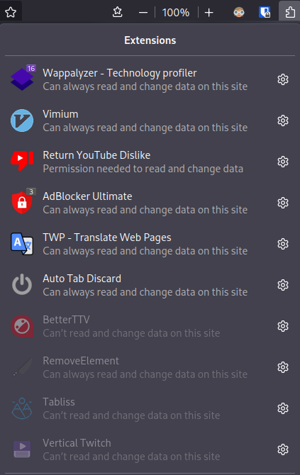

# OS

xorg
pulseaudio
awesome-git
dhcpcd: assigns local IP
picom-jonaburg
alacritty + theme tokyonight
thunar
ranger
timeshift
duf
htop
rxfetch
aether greeter
pamixer
brightnessctl
redshift
rofi
cronie
network manager + nmcli
edex-ui
tmux

# Alacritty

zsh
oh my zsh
zsh-syntax-highlighting
zsh-autosuggestions

# Editor

hexcurse
lvim + theme tokyonight / flatwhite
[Health problem](https://github.com/ekickx/clipboard-image.nvim/pull/48)

# Terminal

htop
nvtop
ag: grep but better
fzf: find but better
tldr: man but better
bc: calculator
calcure: calendar
rsync: copy file to nas
ix: copy file to temporary url
grip: markdown renderer
live-server
ncdu: view folders size
bmon: monitor network usage

## Custom commands

todo
money
stopwatch
mount_nas
weather
weather_full
draw

# lxappearance

papirus dark
orchis
cantarell
jetbrains mono

# Firefox

Vimium
Tab Stash
Dark mode

git
firefox
thunar
lxappearance
picom
papirus maia
orchis
jetbrains mono nerd font
oh my zsh
arc icon theme
neovim + lunar vim
heroic games launcher
gnome disk utility
mangohud
blender
discord
flameshot
tailscale
moonlight
arandr
acpi
alsa-utils
zsh-syntax-highlighting
kotlin
qt5ct
steam = https://www.makeuseof.com/turn-arch-linux-into-a-gaming-system-with-steam/
breeze = https://unix.stackexchange.com/questions/680483/how-to-add-qt-qpa-platformtheme-qt5ct-environment-variable-in-arch-linux
gThumb
vlc
optimus manager
lightdm
gradle
nodejs
npm
nvtop
bluez + bluez-utils
virt-manager
gnu-netcat
wireshark-qt
ghidra
pandoc
cmake
moonlight
zerotier
tailscale

grip
live-server
portainer
github-desktop
lazygit
lazydocker

# Fix unwanted committed file

git filter-repo --use-base-name --path <file_name> --invert-paths --force
git push --set-upstream <git_url> <main_branche_name> --force
